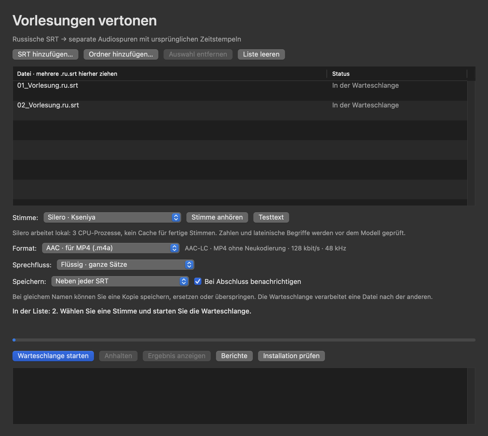

# SRT to Sound 3.5.0 — Benutzer- und Entwicklerhandbuch

[Benutzerhandbuch](https://popovantondev.github.io/SRTtoSound/Guide-de.html)

Dokumentation auf Deutsch. Weitere Sprachen: [English](README.en.md) · [Русский](README.ru.md) · [Projektübersicht](README.md).

## Schnellstart

Laden Sie das aktuelle Release 3.5.0 herunter, entpacken Sie das Archiv und lesen Sie vor der Nutzung die Versionshinweise. Befolgen Sie vor der Sprachsynthese die [deutsche Installationsanleitung](docs/INSTALLATION.de.md), um FFmpeg, die separate Python-/Silero-Umgebung und das Modell einzurichten. Fügen Sie anschließend fertige russische Untertiteldateien (`.ru.srt`) oder einen Ordner hinzu. Wählen Sie eine von fünf Silero-Stimmen (Kseniya ist voreingestellt), AAC/M4A oder WAV sowie den Speicherort. Die Quelldatei bleibt unverändert.

Die Verarbeitung läuft lokal. Siri und macOS-Systemstimmen sind in dieser Version nicht enthalten.

### Abhängigkeiten und erste Audiospur

FFmpeg, eine separate Python-3.12-ARM64-Umgebung und das Silero-Modell `v5_5_ru.pt` sind erforderlich und müssen separat eingerichtet werden. Sie sind nicht im App-Bundle enthalten. Das Release-Archiv enthält die Liste der festgelegten Abhängigkeiten, jedoch nicht die installierten Pakete oder Modellgewichte. Während der Vertonung lädt oder installiert die App nichts. Für Silero gilt in diesem Projekt strikt: nur private, nichtkommerzielle Nutzung; Modellgewichte werden nicht weitergegeben. Lesen Sie vor der Nutzung die [Drittanbieterhinweise](THIRD_PARTY.de.md).

Voraussetzung sind macOS 15+ und Apple Silicon. Releases sind nicht notarisiert; macOS kann eine Sicherheitswarnung anzeigen. Prüfen Sie vor dem Öffnen die veröffentlichte SHA-256-Prüfsumme. Umgehen Sie Sicherheitsabfragen nur, wenn Sie dem verifizierten Release vertrauen.

## Dokumentation für Benutzer

- [Installationsanleitung](docs/INSTALLATION.de.md)
- [Änderungsprotokoll](CHANGELOG.de.md)
- [Hinweise zu Drittkomponenten und Modellbedingungen](THIRD_PARTY.de.md)

## Dokumentation für Entwickler

Folgen Sie der [deutschen Bau- und Testanleitung](docs/BUILD.de.md). Dort stehen die Testbefehle, der sichere Ausgabeordner und die Grenzen der Release-Paketierung.

## Fehlerberichte

Ersetzen Sie echte Namen und Inhalte durch synthetische Beispiele. Entfernen Sie persönliche Daten, private Untertitel, Audio/Video, Logs, absolute Pfade, Benutzernamen sowie gerätebezogene Stimmen- und Modelldetails. Verwenden Sie das [deutsche Fehlerformular](https://github.com/popovantondev/SRTtoSound/issues/new?template=bug_report_de.yml) oder das [Formular für Funktionswünsche](https://github.com/popovantondev/SRTtoSound/issues/new?template=feature_request_de.yml). Beide Vorlagen sind lokalisiert und erinnern an den Datenschutz. Screenshots dürfen nur synthetische Dateien zeigen.

## Downloads und Rechte

Das aktuelle macOS-Release, das Quellcodearchiv und die SHA-256-Prüfsummen finden Sie unter [SRT to Sound 3.5.0](https://github.com/popovantondev/SRTtoSound/releases/tag/v3.5.0). Die App ist ad-hoc signiert und von Apple nicht notarisiert; FFmpeg, Python 3.12 ARM64, Silero-Pakete und Modellgewichte müssen separat installiert werden. Lesen Sie vor der Nutzung die [deutschen Nutzungsrechte](RIGHTS.de.md) und [Drittanbieterhinweise](THIRD_PARTY.de.md).
