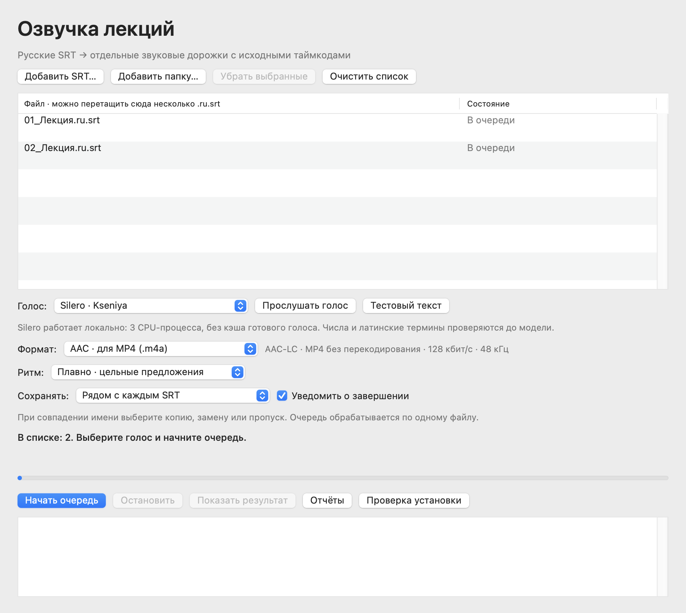

# SRT to Sound 3.5.0 — руководство пользователя и разработчика

Документация на русском. Другие языки: [English](README.en.md) · [Deutsch](README.de.md) · [обзор проекта](README.md).

## Быстрый запуск

Когда появится проверенный выпуск, скачайте и распакуйте архив, прочитайте примечания к версии. Добавьте готовые русские субтитры `.ru.srt` или папку, выберите один из пяти голосов Silero (по умолчанию Kseniya), AAC/M4A или WAV и место сохранения. Исходный SRT не изменяется.

Обработка выполняется локально. Siri и синтез системными голосами macOS в эту версию не входят.

### Зависимости и первая дорожка

FFmpeg, отдельное окружение Python 3.12 ARM64 и модель Silero `v5_5_ru.pt` обязательны и настраиваются отдельно. Они не входят в пакет приложения; архив выпуска содержит список закреплённых зависимостей, но не установленные пакеты и веса модели. Перед первой озвучкой пройдите [инструкцию по установке](docs/INSTALLATION.md). Во время озвучки программа ничего не скачивает и не устанавливает. Для Silero мы фиксируем строгий режим: только личное некоммерческое использование; веса модели не распространяются. Прочитайте [уведомление о сторонних компонентах](THIRD_PARTY.ru.md).

Требуются macOS 15+ и Apple silicon. Выпуски не нотариально заверены; macOS может показать предупреждение безопасности. Перед запуском проверьте SHA-256 опубликованного архива. Обходите системные предупреждения только для проверенного выпуска, которому доверяете.

## Документы пользователя

- [Установка и первая дорожка](docs/INSTALLATION.md)
- [История изменений](CHANGELOG.md)
- [Сторонние компоненты и условия модели](THIRD_PARTY.ru.md)

## Документы разработчика

Следуйте [русской инструкции по сборке и тестам](docs/BUILD.md). В ней описаны команды проверки, безопасный каталог сборки и границы подготовки релиза.

## Сообщения об ошибках

Заменяйте настоящие имена и материалы синтетическими примерами. Удаляйте личные данные, приватные субтитры, аудио/видео, журналы, абсолютные пути, имена пользователей и настройки голосов/моделей конкретного компьютера. Используйте [русскую форму сообщения об ошибке](.github/ISSUE_TEMPLATE/bug_report_ru.yml) или [форму предложения функции](.github/ISSUE_TEMPLATE/feature_request_ru.yml). Формы локализованы и напоминают удалить личные данные. На снимках экрана должны быть только синтетические файлы.

## Загрузки и права

Опубликованные файлы будут находиться в разделе Releases. В каждой записи должны быть архив, SHA-256, примечания к версии и ясные уведомления об отсутствии нотариального заверения и внешних зависимостях. Перед использованием прочитайте [условия прав](RIGHTS.ru.md) и [уведомление о сторонних компонентах](THIRD_PARTY.ru.md).
