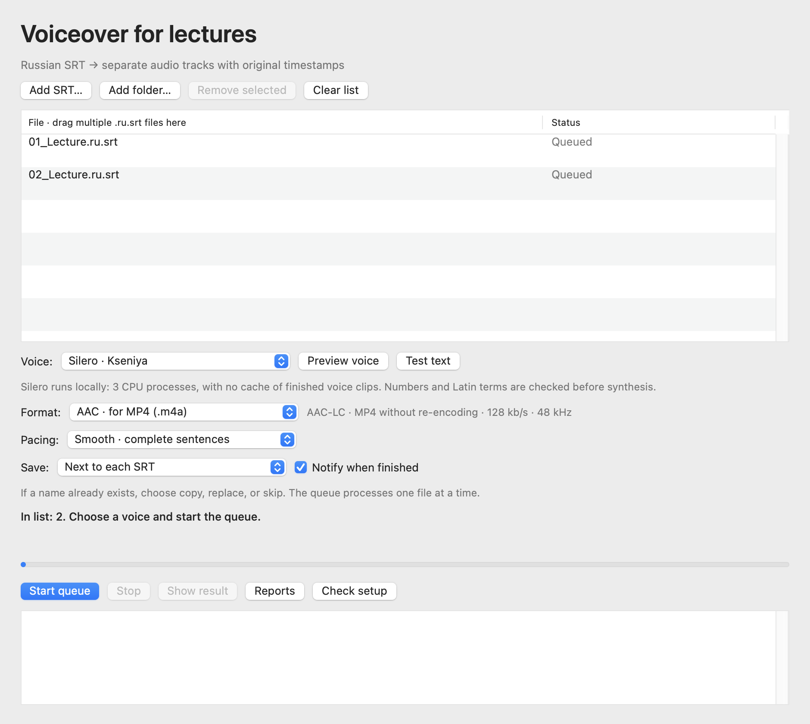

# Build and test SRT to Sound

English guide · [Deutsch](BUILD.de.md) · [Русский](BUILD.md) · [Installation](INSTALLATION.en.md)



This guide applies to the current 3.5 series. It contains no machine-specific paths or user data.

## Requirements

- macOS 15 or newer on Apple silicon;
- Xcode Command Line Tools (`xcrun --find swiftc` and `/usr/bin/ruby --version` should work);
- a separate FFmpeg installation for AAC export and timing adjustment.

Silero is not required to compile the app or run the synthetic test suite. To exercise real synthesis, follow the [installation guide](INSTALLATION.en.md) for the dedicated Python 3.12 ARM64 environment and the separately obtained model.

## Verify and build

From the repository root:

```sh
./scripts/test.sh
./scripts/build.sh
```

The test script reports its actual run, failure, error, and skip counts. The build creates a new `dist/SRT to Sound 3.5.0.app`, refuses to overwrite an existing app, and does not install or launch it. An optional argument selects a different output directory.

## Release packaging

Release packaging is a separate, reviewed step. `PUBLIC_EXPORT_FILES.txt` is the exact source-export allowlist; the packaging script reads it from the release tag, rejects unsafe or untracked paths, and archives only those files. It also requires a clean checkout matching the version tag, verifies the app and embedded source manifest, and refuses to replace an existing version directory. Do not run it against an incomplete review tree or a release that has not passed owner acceptance.

The app is ad-hoc signed, not notarized by Apple. FFmpeg, Python packages, Silero, and model weights remain separate dependencies. Read [third-party notices](../THIRD_PARTY.en.md) and [rights](../RIGHTS.en.md) before preparing a public archive.
